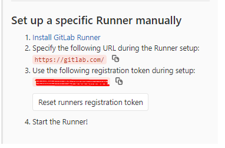
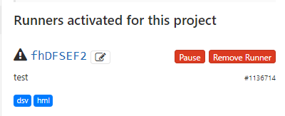

# DEVOPSTUFF

Various commands, important tutorials and settings for building and deploying services in a continuous way.

**Approached Infrastructure Providers:** Digital Ocean & Microsoft Azure.

**CI:** GitLab CI.

**Author:** Levindo Gabriel Taschetto Neto.

## Install GitLab Runner
Used to take and run the jobs from GitLab.
```shell
curl -L https://packages.gitlab.com/install/repositories/runner/gitlab-runner/script.deb.sh | sudo bash
sudo apt-get install gitlab-runner
```

## Register the Runner
### On GitLab
1. Go to the Project.
2. Settings.
3. CI/CD.
4. Expand the **Runners** menu.
5. Click "Disable shared Runners".
6. Pay attention to the following information:



### On the Machine
```shell
sudo gitlab-runner register
```
* **gitlab-ci coordinator URL:** *2.* from the previos image.
* **gitlab-ci token for this runner:** *3.* from the previos image.
* **gitlab-ci description for this runner:** Anything.
* **gitlab-ci tags for this runner:** Tasks from the *.gitlab-ci.yml* file.
* **gitlab-ci coordinator URL:** docker.
* **gitlab-ci coordinator URL:** Any image, once this info is specified within the *.gitlab-ci.yml* file.

If everything went smoothly, this message will show up:
```shell
Runner registered successfully. Feel free to start it, but if it is running already the config should be automatically reloaded!
```

And the runner should appear on the activated runners within the same page of configuration.



## Add SSH_PRIVATE_KEY
https://docs.gitlab.com/ee/ci/ssh_keys/
SSH_PRIVATE_KEY <- id_rsa in the ci settings variables
```shell
cat ~/.ssh/id_rsa.pub > ~/.ssh/authorized_keys
```

## Subdomain Redirect to an Other IP/Port
### Install NGINX for reverse proxying

```shell
sudo apt-get install nginx
sudo nano /etc/nginx/sites-available/default
```

Copy (nginx-config/http2)[nginx-config/http2] into it.

### Verify the config's syntax
```shell
nginx -t -c /etc/nginx/nginx.conf
```

### To properly restart NGINX after changing the config file
```shell
service nginx reload
```

Which results in a
```log
YEAR/MONTH/DAY HOUR:MINUTE:SECOND [notice] 69063#69063: signal process started
```
on `/var/log/nginx/error.log`.

### Check NGINX's log
```shell
cat /var/log/nginx/error.log
```

### Set Up HTTPS

```shell
sudo mkdir /etc/nginx/ssl
sudo chown -R root:root /etc/nginx/ssl
sudo chmod -R 600 /etc/nginx/ssl

openssl dhparam -out /etc/nginx/ssl/dhparam.pem 2048
```

```
sudo service nginx stop
```

#### Get Certbot
```
sudo apt-get update
sudo apt-get install software-properties-common
sudo add-apt-repository ppa:certbot/certbot
sudo apt-get update
sudo apt-get install python-certbot-nginx
```

#### Create a certificate for each app

Options may be found on (ssl)[ssl].
```
sudo certbot --nginx-server-root /etc/nginx
```

### Add SSL Certificate

## Problems Found on the Way

### Unzip not Found
```
apt-get install unzip
```

### If INFO: 1 key(s) Remain(s) to be Installed:
https://www.digitalocean.com/community/questions/ssh-copy-id-not-working-permission-denied-publickey

### Assign a Runner to Multiple Projects
https://dzone.com/articles/changing-a-gitlab-runner-from-locked-to-a-project

### Error to Restart NGINX

It happened because the apache2 service was also running, therefore:

```
sudo /etc/init.d/apache2 stop
```
